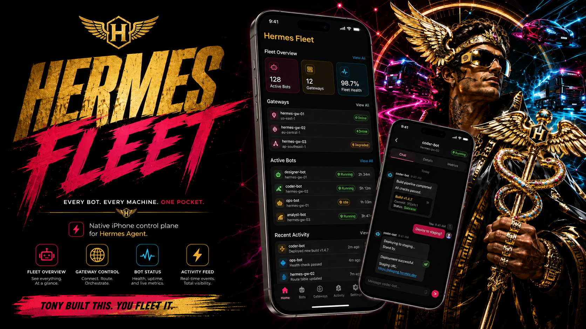

# Hermes Fleet for iOS

<p align="center">
  
</p>

*Hero art by Tony Simons. The dashboard above depicts an aspirational
multi-region fleet (128 bots, 12 gateways); today's app dogfoods a single or
dual gateway over LAN and Tailscale/tailnet — see the Milestone map below.*

Native Hermes fleet control plane for iPhone. The phone is the control plane;
Hermes machines are the agent/compute plane.

**Status:** Active development — the client supports gateway connections,
streaming conversations, multiple authentication modes, Keychain credential
storage, SwiftData caching, connection health, and biometric app lock. CI and
hosted test coverage are being closed in the public-snapshot preparation pass.
See the **Milestone map** below for the full history; the M0 skeleton notes in
`docs/M0-foundation.md` are historical foundation evidence, not current status.

## Repository / workspace

- **Path:** the repository root (the dev workstation)
- **Project:** generated from `project.yml` via xcodegen (single source of
  truth — never hand-edit the `.pbxproj`)
- **Toolchain:** Xcode 26.6 (Build 17F113), Swift 6.3.3, iOS 17+ deployment,
  Swift 6 language mode, iOS 26.5 simulator runtime

## Module layout (dependency direction)

```
FleetCore          pure domain: GatewayID, ProfileSlug, AuthorizationClass,
                   FleetGateway, GatewayEndpoint (origin normalization),
                   Redaction, transport seam + health/retention models
   ▲
   ├──── FleetNetworking   (JSON-RPC/WebSocket transport, gateway registry,
   │                        roster, session/conversation/replay clients)
   ├──── FleetSecurity     (Keychain credential/token stores + atomic upsert)
   ├──── FleetPersistence  (SwiftData non-secret cache + health stats)
   └──── FleetUI           (SwiftUI: roster, bot detail, conversation,
                            gateways, health dashboard, app-lock screens)

HermesFleetApp     app target = composition root; depends on ALL modules;
                   wires seams into the UI. The ONLY module that imports
                   FleetNetworking.
```

One-directional, acyclic. **SwiftUI (`FleetUI`) never depends on
`FleetNetworking`** (the JSON-RPC/WebSocket module) — the M0 hard guard,
verified by `ModuleBoundaryTests` in CI. The `HermesTransport` seam lives in
`FleetCore`; the composition root (`HermesFleetApp`) is what wires transport
in.

| Module | Responsibility | Depends on |
|---|---|---|
| FleetCore | Pure domain types, origin/redaction policy, transport + health seams | — |
| FleetNetworking | JSON-RPC/WebSocket transport, registry, roster, session, conversation, replay | FleetCore |
| FleetSecurity | Keychain stores (atomic upsert) | FleetCore |
| FleetPersistence | SwiftData non-secret cache + health stats | FleetCore |
| FleetUI | SwiftUI shell: roster, bot detail, conversation, gateways, health dashboard, app lock | FleetCore, FleetSecurity, FleetPersistence |
| HermesFleetApp | Composition root, app lifecycle | all |

## Milestone map

| Milestone | What landed | Status |
|---|---|---|
| M0 Foundation | Xcode project + modular SPM skeleton | Historical foundation evidence (`docs/M0-foundation.md`) |
| M1 Protocol core | FleetNetworking WebSocket JSON-RPC transport | Landed (`docs/M1-protocol-core.md`) |
| M2 Gateway/Bot Identity + Routing | Profile/route identity, routing rules | Landed (`docs/M2-identity-routing.md`) |
| M3 One-Gateway Connectivity | `SingleGatewayConnection` over M1 transport | Landed (`docs/M3-gateway-connectivity.md`) |
| M4 Session Read Path | `session.history`/`status` read-only seam | Landed (`docs/M4-session-read-path.md`) |
| M5 Conversation Streaming | `session.create/resume`, `prompt.submit`, streamed events | Landed (`docs/M5-conversation-streaming.md`) |
| M6 Reconnect/Replay | re-connectable transport + replay engine | Landed (`docs/M6-reconnect-replay.md`) |
| M7 Gateway Registry | add/edit/remove gateways, auth config, probe | Landed (`docs/M7-gateway-registry.md`) |
| M8 Multi-Gateway Fleet Roster | union roster aggregation + partial-outage resilience | Landed (`docs/M8-multi-gateway-roster.md`) |
| M9 Routing Collision Hardening | traversal guards + fail-closed ambiguity | Landed (`docs/M9-routing-collision-hardening.md`) |
| M10 Persistence/Cache | Keychain token store + SwiftData non-secret cache | Landed (`docs/M10-persistence-cache.md`) |
| M11 Authentication Hardening | `AuthenticationProviding` seam, loopback token, TTL, redaction | Landed (`docs/M11-authentication-hardening.md`) |
| M14 Visual Identity | Black/White/Signal-Red theme + assets | Landed (`docs/M14-visual-identity.md`) |
| M15 Device Dogfood | build/install/launch PASS on a real device | Landed (`docs/M15-device-dogfood.md`) |
| U1 App runtime + navigation | Observable `AppEnvironment` over FleetCore seams | Landed (`docs/U1-app-runtime-navigation.md`) |
| U2 Roster + Bot detail + Gateways | fleet roster / bot detail / gateway management screens | Landed (`docs/U2-roster-bot-detail-gateways.md`) |
| U3 Conversation screen | streaming, replay, reconnect UX | Landed (`docs/U3-conversation-screen.md`) |
| U4 Dogfood | §32 walkthrough steps 1-10 PASS + G1 XCUITest | Landed (`docs/U4-dogfood.md`) |
| L1 Live gateway dogfood | app connects to a REAL Hermes gateway | Landed (`docs/L1-live-dogfood.md`, `docs/L1-fix.md`) |
| C1 CI pipeline | GitHub Actions build+test+secrets gate | Landed (`.github/workflows/ci.yml`) |
| S2 Stable message identity | kill `hashValue` fallback for message ids | Landed (commit `40964d6`) |
| S3 Cleartext warning | gateway form warns on non-TLS endpoints | Landed (commit `273c2ad`) |
| T2 Tailscale/tailnet transport | app connects over an encrypted tailnet endpoint | Landed (commit `5a0aa6c`) |
| X1 Launch screen | LaunchScreen.storyboard wired | Landed (commit `a1c73e7`) |
| H1 Biometric app lock | FaceID app lock with passcode fallback | Landed (commits `8f3a944`, `523e413`) |
| H2 Connection health dashboard | per-gateway uptime / reconnects / last-disconnect / ping RTT | Landed (commits `b874325`, `b5e80ad`) |
| RT1 Session ownership + replay integrity | one transport per gateway, atomic replay hold, fail-closed replay validation | **Implemented + approved (apple-qa PASS) on `wt/t_c495dd5a`; merge to main pending** |
| RT2 Endpoint sanitization + removal + Keychain safety | endpoint-as-origin, removal confirm/undo, Keychain upsert | Landed (commit `77379e9`) |
| RT3 Junk-frame liveness + initial recovery + deterministic UI in CI | junk frames no longer refresh liveness; conversation initial recovery; UI suites in CI | Landed (commit `a1c43bb`) |
| RT4 UX/reliability polish | P2-3/5/6/7/8 + P3-1 (transcript windowing, roster empty state, form retry, VoiceOver, removal) | Landed (commit `89c2c55`) |
| RT5 Docs truth pass + ADRs | this README milestone map + `docs/adr/` | This change |
| R9 Pocket Desktop (approvals, YOLO, model picker, context meter, steer/rename/fork, cron, skills) | desktop-parity features over the WS surface | Landed (`docs/R9-pocket-desktop.md`; commits `5603f15`, `255da9f`, `5596900`, `c8cfd2f`, `66919f4`) |
| R9 Memory Graph (read-only star map) | learning star map: pan/zoom canvas, All/Skills/Memories filter, timeline scrubber, offline snapshot | Landed (`docs/R9-pocket-desktop.md`) |
| R10 Pocket Parity II | attachments, reactions, Projects browser, client-side voice, memory-graph edit/delete | Accepted; build 18 prepared for TestFlight (`docs/R10-pocket-parity-ii.md`) |

Milestone numbering is historical: M12/M13 have no standalone docs (M13
appears as a HOLD in the D1 fix commit `47cacef`; folded into the M14/M15
evidence); M0–M11, M14, M15 carry docs. See `docs/adr/` for the architectural
decision records behind the post-M15 hardening wave (session ownership, replay
validation, endpoint trust, transcript retention, credential failure
semantics).

## Validation commands

Prerequisites: Xcode 26.6, `xcodegen` (2.46.0), an iOS 26.x simulator.

```sh
make generate          # xcodegen generate (project.yml → .xcodeproj)
make build             # simulator build
make test              # hosted unit tests on the iOS simulator
make test-core         # FleetCore package tests on host (fast, pure domain)
make validate          # generate + build + test + test-core
```

The destination resolves `iPhone 17 Pro` dynamically; edit `DEST` in the
Makefile if your simulator set differs. CI (`.github/workflows/ci.yml`) runs
`scripts/c1_ci_validate.sh` — 4 package `swift test` suites, the module-boundary
guard, the hosted unit bundle, the deterministic UI suites, and a gitleaks
secret scan.

## Directory map

```
HermesFleetApp/         app target source + asset catalog
HermesFleetAppTests/    hosted unit tests (app + cross-module boundary)
HermesFleetAppUITests/  deterministic scripted-fleet UI suites (CI) + environmental suites (local)
Packages/
  FleetCore/            pure domain + tests
  FleetNetworking/      JSON-RPC/WebSocket transport + registry/roster/session/replay
  FleetSecurity/        Keychain stores
  FleetPersistence/     SwiftData cache + health stats
  FleetUI/              SwiftUI shell + view models
docs/M0-foundation.md   M0 scope/decisions (HISTORICAL foundation evidence)
docs/M1…M15/, docs/U1…U4/   milestone + UX notes
docs/adr/               architecture decision records (post-M15 hardening)
scripts/                validation / evidence scripts (c1, s2, s3, t2, rt1…rt5)
```

## Secrets

No sensitive values live in this repo. Tokens, keys, and credentials never go
in source, logs, or artifacts — they are stored in the Keychain only
(`FleetSecurity`, `WhenUnlockedThisDeviceOnly`, no iCloud sync). Endpoints are
treated as origins: user-info and query/fragment are rejected/stripped at the
registry boundary, and logged/displayed URLs are redacted.

## M0 acceptance (historical)

The original 11/11 M0 acceptance criteria were verified on 2026-08-28 — see
`docs/M0-foundation.md` for the evidence mapping. Those criteria describe the
M0 skeleton and are **historical**: the project has since shipped M1–M15,
U1–U4, L1, C1, S2, S3, T2, X1, H1, H2 and the RT hardening wave (see the
Milestone map above).
